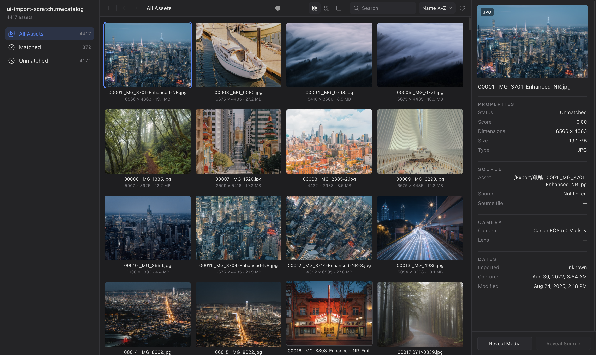

# Media Resource Management

[English](README.md) | **简体中文**

一个本地优先的媒体资源工作台，用于浏览、整理和核对大规模照片与媒体资产。

这个项目面向经常处理大量导出文件的人，帮助你更快看清哪些内容已经关联、哪些还需要处理，以及每个资源的来源信息。

## 产品能做什么

Media Resource Management 可以帮助你：

- 将处理后的媒体素材集中到一个可视化工作台中
- 一眼区分 **Matched** 与 **Unmatched** 资源
- 以高密度图库视图快速浏览大规模素材库
- 不离开工作台即可查看预览和文件详情
- 为不同项目、客户或审核批次维护独立 catalog

## 适用场景

这个产品适合：

- 管理 RAW 与导出 JPG 的摄影师
- 审核大量交付文件的图片编辑
- 需要整理导出后素材流程的工作室
- 希望用更直观、更安静的方式替代逐文件夹检查的创意团队

## 典型工作流

1. 为一个项目打开或创建 catalog。
2. 添加源素材和处理后的导出文件。
3. 让工作台自动整理并呈现可能的关联关系。
4. 在一个界面中统一浏览全部内容。
5. 重点处理仍需确认、审核或清理的资源。

## 当前体验

当前桌面端体验聚焦于高效的视觉审核：

- 用 **All Assets** 查看完整素材库
- 用 **Matched** 和 **Unmatched** 快速分流
- 用大画廊区域高效扫图
- 用右侧检查面板查看预览、尺寸、格式和来源信息
- 通过本地 catalog 工作流让每个工作空间保持独立、清晰

## 为什么强调本地优先

你的媒体资源依然保留在自己的存储设备和工作环境中。

这意味着它更适合这类需求：

- 希望源文件继续保留在自己的硬盘或移动存储中
- 希望沿用现有的文件夹结构
- 希望在审核阶段避免不必要的云端复杂度
- 希望在不迁移全部素材系统的前提下，先获得一个清晰的审核工作台

## 仓库中包含什么

这个仓库包含实现上述产品体验的内容：

- 桌面审核应用
- catalog 与 workspace 示例
- 导入与匹配服务
- 相关文档、设计探索和测试

## 项目状态

这是一个仍在早期、但已经具备可用方向的产品，核心目标很明确：

**让大规模媒体素材库更容易被审核、被核对、被信任。**

当前范围有意保持克制，优先打磨浏览、匹配与检查体验，再逐步扩展到更复杂的工作流或协作能力。

---

如果你想查看实现说明或更深入的技术细节，请阅读 [docs/developer-setup.md](docs/developer-setup.md)。
